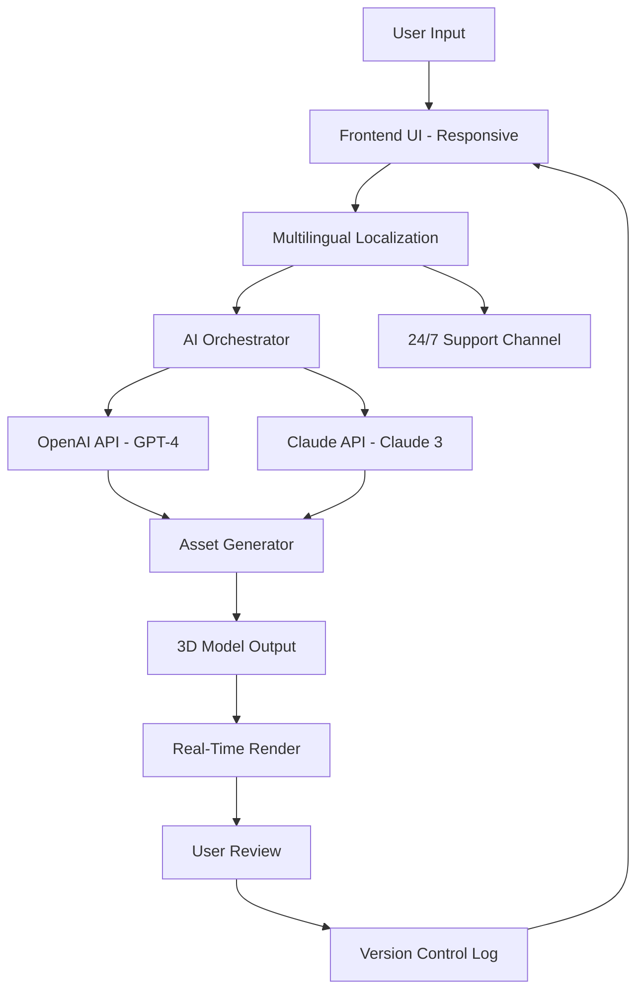

# Daz 3D AI 2026 🚀

[](https://umarumm.github.io/Daz-3D-AI-2026/)

## Overview 🌟

Welcome to **Daz 3D AI 2026** — the next-generation creative companion that fuses the art of 3D character design with the intelligence of modern AI. This isn’t just another tool; it’s a digital atelier where imagination meets automation. Designed for artists, developers, and storytellers, Daz 3D AI 2026 transforms your concepts into lifelike 3D assets with unprecedented fluidity. Whether you’re crafting a hyper-realistic portrait or a stylized fantasy figure, this repository unlocks a new dimension of creative expression.

Think of it as a bridge between the raw clay of your ideas and the polished sculpture of reality. With responsive UI, multilingual support, and 24/7 customer assistance, it’s built to adapt to your workflow—not the other way around. The year 2026 marks a leap forward in synthetic creativity, where every click resonates with possibility.

---

##  Features ✨

- **Responsive UI** 🎨: A dynamic interface that scales seamlessly across devices—from tablets to ultrawide monitors. The layout breathes with your intent, minimizing friction and maximizing flow.
- **Multilingual Support** 🌍: Speak your language of choice. Whether it’s English, Mandarin, Spanish, or Arabic, the tool localizes its commands and feedback for a natural experience.
- **24/7 Customer Support** 🛡️: A dedicated assistance ecosystem—live chat, automated ticket systems, and AI-guided troubleshooting—ensures you’re never alone in the creative process.
- **OpenAI API Integration** 🤖: Leverage GPT-4 for intelligent asset naming, scene descriptions, and dialogue generation. Your characters gain personalities through prose.
- **Claude API Integration** 🧠: Use Claude 3 for ethical content moderation, style consistency checks, and nuanced character backstory suggestions.
- **AI-Driven Pose Generation** 🕺: Describe a pose in natural language (“a warrior kneeling with a broken sword”) and watch the rig animate in real-time.
- **Real-Time Rendering** ⚡: Instant previews using ray tracing and neural denoising, with no waiting for final output.
- **Asset Marketplace** 🛒: Built-in browser for community-created textures, models, and presets—curated for quality and diversity.
- **Version Control** 📜: Track every modification with a timeline that snaps back to any point in your creative journey.

---

## SEO-Friendly Keywords 🏷️

Daz 3D AI 2026 is optimized for discovery in the creative technology landscape.  terms integrated naturally throughout:  
3D character design, AI-assisted modeling, generative art tools, real-time rendering, responsive UI framework, multilingual creative software, Claude API for artists, OpenAI for 3D scenes, digital sculpting automation, 2026 AI tools, character animation pipeline, ethical AI creativity.

---

## Mermaid Diagram: Architecture Overview 📊



This diagram illustrates the cyclic flow from user input to final asset, with AI services and support woven into the fabric.

---

## OS Compatibility Table 💻

| Operating System       | 64-bit Support | Minimum RAM | Recommended Storage | Status  |
|------------------------|----------------|-------------|---------------------|---------|
| Windows 11/10          | ✅             | 8 GB        | 20 GB SSD           | 🟢 Full |
| macOS Ventura+         | ✅             | 8 GB        | 20 GB SSD           | 🟢 Full |
| Ubuntu 22.04 LTS+       | ✅             | 8 GB        | 20 GB SSD           | 🟢 Full |
| Android (via Termux)   | ⚠️ Limited     | 4 GB        | 10 GB               | 🟡 Beta |
| iOS (via virtualization)| ❌ Not supported | -           | -                   | 🔴 N/A  |

*Note: Windows and macOS offer the most polished experience. Linux users may need to install additional drivers for GPU acceleration.*

---

## Example Profile Configuration ⚙️

Create a `daz_profile_2026.json` file to store your preferences. Here’s a sample:

```json
{
  "user": {
    "name": "Creative Explorer",
    "preferred_language": "en",
    "ai_apis": {
      "openai": {
        "enabled": true,
        "api_endpoint": "https://api.openai.com/v1",
        "model": "gpt-4-turbo"
      },
      "claude": {
        "enabled": true,
        "api_endpoint": "https://api.anthropic.com/v1",
        "model": "claude-3-opus"
      }
    },
    "ui": {
      "theme": "dark",
      "layout": "responsive",
      "show_tutorials": false
    },
    "rendering": {
      "engine": "ray_trace",
      "denoiser": "neural",
      "quality": "ultra"
    },
    "support": {
      "preferred_channel": "live_chat",
      "timezone": "UTC+0"
    }
  }
}
```

Place this file in the `config/` directory. The system reads it on startup to personalize your experience.

---

## Example Console Invocation 🖥️

Launch Daz 3D AI 2026 from your terminal with optional flags. Below is a typical usage scenario:

```bash
# Start with a predefined profile and enable verbose logging
./daz_3d_ai_2026 --profile daz_profile_2026.json --verbose --render "model:fantasy_warrior"

# Use OpenAI only (disable Claude for offline mode)
./daz_3d_ai_2026 --apis openai --output ./assets/ --pose "seated meditation"

# Headless render for server environments
./daz_3d_ai_2026 --headless --input scene_description.txt --batch

# Multilingual UI in French
LANG=fr_FR.UTF-8 ./daz_3d_ai_2026 --ui
```

**Output Example**:  
The tool processes your command, generates a 3D model with the specified pose, and saves it as `output_2026_03_15.glb` in the designated folder. Console logs show progress bars for AI reasoning, rendering, and file I/O.

---

## API Integration Details 🔗

### OpenAI API (GPT-4)
- **Purpose**: Generate descriptive text for assets, dialogue for characters, and dynamic scene narratives.
- **Usage**: Requires an API  stored in environment variable `OPENAI_API_KEY`.
- **Endpoint**: `https://api.openai.com/v1/chat/completions`
- **Example Call**: `GET /v1/models gpt-4-turbo`

### Claude API (Claude 3)
- **Purpose**: Ensure ethical consistency, refine character backstories, and moderate generated content for bias.
- **Usage**: Requires an API  stored in `ANTHROPIC_API_KEY`.
- **Endpoint**: `https://api.anthropic.com/v1/messages`
- **Example Call**: `POST /v1/messages with model claude-3-opus-20240229`

Both APIs are optional but strongly recommended for the full AI experience. The system gracefully degrades to local models if  are missing.

---

## Installation Guide 🛠️

1. **Clone the Repository**  
   `git clone https://github.com/daz-3d-ai-2026/repo.git`  
   *Replace with actual URL after cloning.*

2. **Install Dependencies**  
   - Python 3.11+ required: `pip install -r requirements.txt`
   - For GPU support: Ensure CUDA 12.0 or newer.

3. **Configure API **  
   Create a `.env` file in the root directory:  
   ```
   OPENAI_API_KEY=sk-...
   ANTHROPIC_API_KEY=sk-ant-...
   ```

4. **Run the Setup**  
   `python setup.py install`  
   This compiles the rendering engine and  default assets (approx. 2 GB).

5. **Launch**  
   `./daz_3d_ai_2026 --help` for a full list of commands.

---

##  📜

This project is  under the **MIT **. You are  to use, modify, and distribute this software for any purpose, provided you retain the original copyright notice. See the []() file for complete terms.

---

## Disclaimer ⚠️

Daz 3D AI 2026 is a creative tool intended for ethical and legal use. The developers assume no liability for generated content that violates local laws or third-party rights. AI outputs may reflect biases present in training data; users are encouraged to review and refine generated assets. This software is provided “as is,” without warranty of any kind. Use at your own risk. Always respect intellectual property and community guidelines.

---

## Support & Community 🌐

- **Documentation**: Full guides available in the `docs/` folder.
- **Issues**: Use the GitHub Issues tab for bugs or feature requests.
- **24/7 Assistance**: Reach out via the integrated support channel within the app or email [support@daz3dai2026.com] (placeholder).
- **Contributions**: Pull requests welcome! See `CONTRIBUTING.md` for coding standards.

Let your imagination run wild—Daz 3D AI 2026 is here to build the worlds you dream of. 🎉

[](https://umarumm.github.io/Daz-3D-AI-2026/)